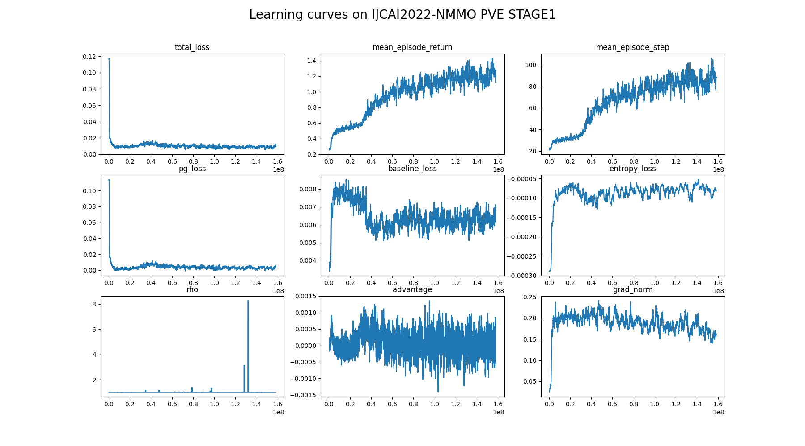

# IJCAI2022-NMMO-PVE-STAGE1 BASELINES
## Install
```bash
pip install git+http://gitlab.aicrowd.com/henryz/ijcai2022nmmo.git
pip install -r requirements.txt
```

A modified [monobeast](https://github.com/facebookresearch/) baseline is provided in `monobeast/`. 
- `monobeast/my-submission/`: Code for submission. 
    - For successful submission, one must copy all files under this directory and the model checkpoint to [`ijcai2022-nmmo-starter-kit/my-submission/`](https://gitlab.aicrowd.com/neural-mmo/ijcai2022-nmmo-starter-kit/-/tree/main/my-submission).
- `monobeast/training/`: Code for training.

## Train and evaluation
```bash
cd monobeast/training

# train
bash train.sh

# plot
python plot.py

# local evaluation
cd monobeast/my-submission
python eval.py
```

## Implementation Details

We provide a baseline implementation. It is a improved version based on the previous baseline[tag]. It can reach 0.5 top1ratio after 2 days' training and 0.8 in 4 days, using 1 V100 and 8 cpu cores. The following is the training curve




### **Overview: RL Move + Scripted Attack**

The action consists of two types, move and attack, which can be executed simultaneously. Forage happens by itself whenever a player steps on a grass or water tile and therefore is not considered into action space.

For simplicity, we only use RL to learn move strategy and use a script for attack strategy. The script always targets the closest defeatable enemy.

```python
class Attack(Scripted):
    '''attack'''
    name = 'Attack_'

    def __call__(self, obs):
        super().__call__(obs)

        self.scan_agents()
        self.target_weak()
        self.style = nmmo.action.Range
        self.attack()
        return self.actions


class AttackTeam(ScriptedTeam):
    agent_klass = Attack
```

### **Feature and network**
We convert the observation to a 15\*15\*17 (width, height, channel) local map. The content for each channel is described as below. For details refer to [`FeatureParser`](./monobeast/training/torchbeast/neural_mmo/train_wrapper.py)：

- terrain (channel 0-6): lava, water, grass, scrub, forest, stone
- camp (channel 7-10): none, teammate, npc, opponent
- entity (channel 11-16): level, damage, timealive, food, water, health, is_freezed

```python
feature_spec = {
    "terrain": spaces.Box(low=0, high=6, shape=(15, 15), dtype=np.int64),
    "camp": spaces.Box(low=0, high=4, shape=(15, 15), dtype=np.int64),
    "entity": spaces.Box(low=0,
                            high=4,
                            shape=(7, 15, 15),
                            dtype=np.float32),
    "va": spaces.Box(low=0, high=2, shape=(5, ), dtype=np.int64),
}
```

The network is implemented as a 5-layer CNN. See [net.py](./monobeast/training/torchbeast/neural_mmo/net.py) for details.

### **Reward**
We provide a simple design for computing reward, shown as below. See
[`this`](./monobeast/training/torchbeast/neural_mmo/train_wrapper.py) for implementation details.
```math
R_t = (\Delta_{PlayerDefeats} + \Delta_{Equipment} + \Delta_{Exploration} + \Delta_{Foraging} + \Delta_{TimeAlive}) / 100
```

It is a dense reward that provides frequent instructional signal to players, 
which makes learning easy but has no direct relation with [evaluation metrics](https://www.aicrowd.com/challenges/ijcai-2022-the-neural-mmo-challenge#evaluation). 


### **Hints**
- Learn attack strategy using RL.
- Optimize feature design and network architecture.
- Use team reward instead of individual reward.
- Tune hyper-parameters.
- Advanced options: distributed RL, self-play, league training, PBT, ... 


## Baselines based on other frameworks
The [NeuralMMO-baselines](https://github.com/NeuralMMO/baselines/tree/ijcai-competition) (ijcai-competition branch) has implemented some baseline agents based on commonly used RL frameworks, such as [cleanrl](https://github.com/vwxyzjn/cleanrl), [sb3](https://github.com/DLR-RM/stable-baselines3), [rllib](https://github.com/ray-project/ray/tree/master/rllib). These baselines are provided to the participants who is familiar with and prefer these frameworks. Choose your favorite to implement your own agent.


## FAQ

##### 1. How can I speed up training?
Ans: You can increase `num_actors`, but restrict to the maximum available cpu cores you have. 

For example, if you have a machine with 16 cores,  you can set `num_actors` to 15 for the fastest training speed. However, this will consume most of your compute resource and make your machine very slow. We recommend setting `num_actors` to 12 at this circumstance.

##### 2. How do I handle "unable to open shared memory object" error when run monobeast baseline?
Ans: This error is usually encountered by the number of open file descriptors exceeding your system's limits. 

You can raise them or try smaller `num_actors, batch_size, unroll_length`. Please refer to [pytorch multiprocessing document](https://pytorch.org/docs/stable/multiprocessing.html#sharing-strategies) for more information.
